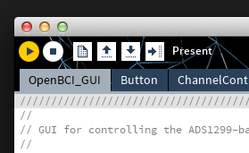

For the full getting started guide, go to [our Docs page](http://docs.openbci.com/tutorials/01-GettingStarted).

### 1. Download Processing for your operating system

**Before I continue, note that you don't need to write any code for this tutorial, though you will see all of the code that makes the OpenBCI GUI run!**

First, go to the [Processing Downloads page](https://www.processing.org/download/?processing) and download the latest stable release for your operating system. Processing is an open source creative coding framework based on Java. If you are familiar with the Arduino environment, you'll feel right at home; the Processing IDE is nearly identical. If not, no worries!

Once it's finished downloading, unzip it and place the Processing .app or .exe where you typically place your applications or programs.

For more information on Processing or for debugging the steps in the next section, check out the [Processing Tutorials page](https://www.processing.org/tutorials/).

### 2. Download the OpenBCI GUI Processing code

 a. [Download the necessary files & directories](https://github.com/OpenBCI/OpenBCI_Processing/archive/master.zip) OR [clone the OpenBCI/OpenBCI_Processing repo](github-mac://openRepo/https://github.com/OpenBCI/OpenBCI_Processing) to your desktop (do this only if you're familiar with Github).

 b. Unzip the download. It should be called OpenBCI_Processing-master after unzip/extract it.

 c. Locate the Processing sketchbook directory on your computer. This should have been created automatically when you installed processing. Depending on your operating system, this directory's path is:

* On Windows: c:/My Documents/Processing/
* On MAC: /Users/your_user_name/Documents/Processing/
* On Linux: /Home/your_user_name/sketchbook/

**Note:** this directory should be called "Processing" on Windows and Mac, and "Sketchbook" on Linux. This directory should already have a subdirectory called "libraries." If it does not, create the subdirectory.

 d. Now, from the OpenBCI_Processing-master directory that you downloaded and unzipped in parts (a) and (b) above, copy the OpenBCI_GUI directory and paste it in the Processing sketchbook directory that you located in part (c) above.

 e. Finally, copy the controlP5 & gwoptics directories from OpenBCI_Processing-master/libraries and paste them into the libraries directory of your Processing sketchbook.

 f. Now everything is where it should be!

### 3. Open Processing & launch the OpenBCI GUI

a. If Processing is currently open, close it. The new libraries you added won't be recognized until you restart the application.

b. Double-click any of the .pde files in the OpenBCI_GUI directory and all of the OpenBCI GUI code should open in the Processing IDE, as seen on the right.

c. Click the "run" button on the top left of the IDE, and the code should run! If it does not, make sure you installed your libraries correctly and that are using the latest version of Processing. If you continue to have issues, please refer to the [software section](http://www.openbci.com/index.php/forum/#/categories/software) of our forum for help.

d. Once the GUI is running, select "SYNTHETIC (algorithmic)" and hit the "START SYSTEM" button to launch the GUI with a synthetic data generator.

e. Click the dark overlay on the GUI to exit the SYSTEM CONTROL PANEL and then hit the "Start Data Stream" button to begin the stream of synthetically generated EEG data. You should then see data streaming across the "EEG Data" graph on the left side of the GUI. 

# OpenBCI_Processing_3
Updated OpenBCI Processing GUI for Processing 3.0

  1. Modified line 158 in OpenBCI_GUI.pde. 2. Added minim into libraries which is downloaded from https://github.com/ddf/Minim. 3. Fixed gwoptics.jar bug.
